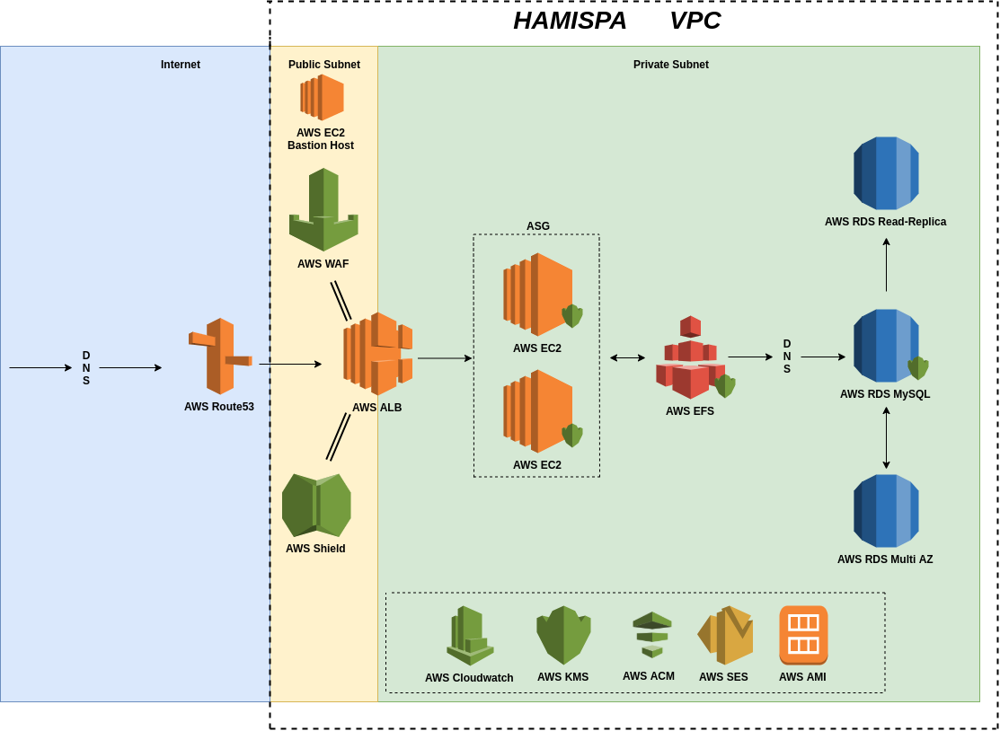
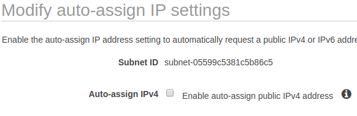
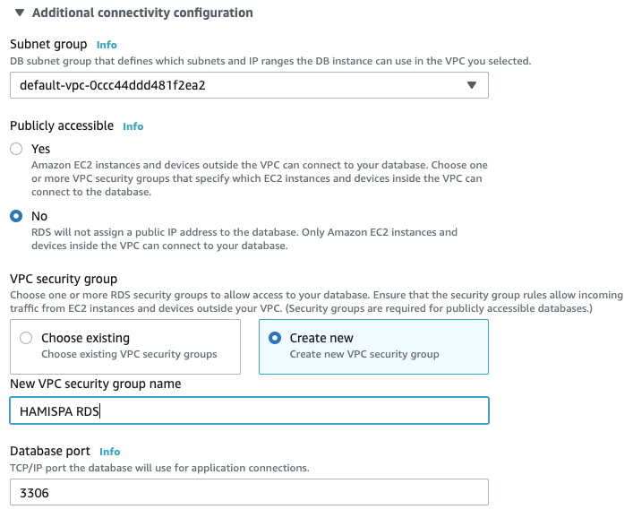
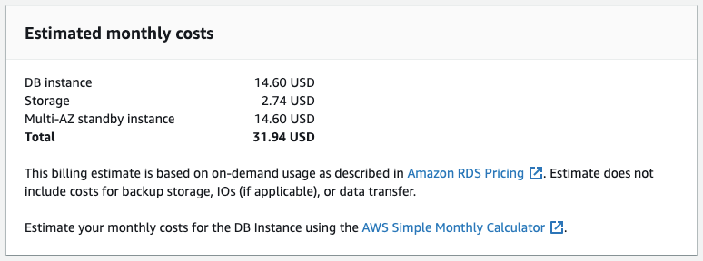
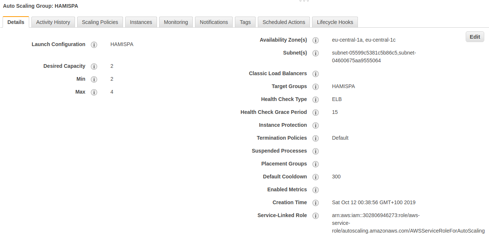

# HAMISPA
Notes for High Availability MISP in AWS

## This repository is still being updated. 

# What is this?

HAMISPA is an experiment, meant to be community-driven, to implement [MISP](https://github.com/MISP/MISP) in a high availability environment. The idea was presented during the [MISP Threat Intellegence Summit 0x05](https://2019.hack.lu/misp-summit/).

The resources section includes the presentation and recording of the talk. 

# Architecture Overview



# Service Details

We'll cover service details from the right of the image to the left *(starting from the database and moving to the edge)*. First, however, we'll cover the network configuration.

## AWS VPC

AWS VPC allows us to have private subnets with non-routable IP addresses that we will use to place our cluster nodes. As it can be seen in the architecture diagram, the cluster nodes are kept inside a private network while only the ALB (Load Balancer) is exposed.

An example configuration for the VPC is a 10.0.0.0/16, with the following subnets:

| Subnet Name | Subnet Range | DHCP for public addresses | Description |
|-------------|--------------|---------------------------|-------------|
HAMISPA Pub 1 | 10.0.0.0/24  |              ON           | Public subnet | 
HAMISPA Pub 2 | 10.0.1.0/24  |              ON           | Public subnet 2 |
HAMISPA Priv | 10.0.2.0/24 | OFF | Private subnet |
HAMISPA Priv 2 | 10.0.3.0/24 | OFF | Private subnet |

Make sure that the private subnets don't have public IP's being given by changing the DHCP options:



## AWS Security Groups

| SG Name | Protocol | Port | Source | Description |
|---------|----------|------|--------|-------------|
Default | All | All | sg-0a5308bd5XXXXX (default) | Default SG |
RDS | TCP | 3306 | sg-0a5308bd5XXXXX (default) | Traffic within the VPC |
ALB | TCP | 80,443 | 0.0.0.0/0 | Allow the internet to reach the load-balancer |
SSH | TCP | 22 | your\_ip | SSH to Bastion, limited to your IP |

Where are the groups applied:

* ALB - Applied to the LoadBalancer 
* SSH - Applied to the Bastion EC2 instance
* RDS - Applied to the RDS instance, allowing it to be reached within the VPC
* Default - Applied to the Cluster Nodes


## AWS RDS

This service is used to provide us with a managed MySQL platform. Benefits of this approach:

* Highly available cluster with Multiple Availability Zones
* DNS of endpoint is automatically updated in the event of a AZ *(Availability Zone)* failure
* Usage of DB read replicas allows additional cluster nodes to access different DB sources, sharing the load on DB access
* Example for the usage of read-replicas could for your IDS systems using the NIDS export feature of MISP to download data, leaving the main DB for read/write interactions

Some heads-up:

* AWS RDS doesn't automatically create a DB. Make sure to use mysql client to create the DB and user, while providing required permissions
* Go into the advance configurations for security and connectivity and make sure to disable “Public Access”:



Some cost estimation for a particular instance type with Multi-AZ



## AWS EFS 

AWS EFS allows us to have a shared filesystem that can be used by many instances at once. It's an NFS-based service that allows us to create a volume without having to provision space or worry about growth. 

This is the part of the system that will hold all of the MISP codebase. Our /var/www/MISP.

After creating the EFS volume, it's recommended to use the [amazon-efs-utils tool](https://docs.aws.amazon.com/efs/latest/ug/using-amazon-efs-utils.html) to mount the volume in the instances.

The following is the correct syntax for **/etc/fstab/** to mount EFS using TLS:

```
fs-53b5bXXX:/ /var/www/MISP efs _netdev,tls 0 0
```

Using this syntax on /etc/fstab requires the installation of the amazon-efs-utils package I linked to above.

## AWS EC2

The compute portion of our architecture. There are two stages to this part:

* AMI Development
* Auto-Scaling

The AMI Development phase is where we launch an EC2 instance and configure/tweak it to our liking. A rought draft of what should be done during AMI Development:

* Update OS
* Install all MISP dependencies 
* Install sSSMTP and configure it to use AWS SES *(next section discussed AWS SES)*
* Configure PHP and configure Apache *(note about this below)*
* Install the amazon-efs-utils and configure /etc/fstab to mount your EFS volume
* Use mysql-client to create a DB your RDS instance, and also set permissions
* Install MISP on the mount point where your EFS is mounted
* After you're happy with the configuration, turn that instance state into an AMI so that future instances utilize the same, prepared, configuration

**Note about Apache**: It's entirely up to your if you'd like to use certificates in your instance or not. In the example that was given, we were doing TLS off loading to the load-balancer, which in turn would use digital certificates that are automatially provisioned from AWS ACM.

If you don't mind maintaining/rotation certificates and you believe that the traffic from the load-balancer to the instances should be done via an encrypted channel, feel free to configure Apache accordingly. 

## AWS SES

Relay e-mails through AWS SES. The following configuration works with sSMTP:

```
root=root@example.com
mailhub=email-smtp.us-east-1.amazonaws.com:465
AuthUser=YOUR_ID
AuthPass=YOUR_PASS
UseTLS=YES
AuthMethod=LOGIN
FromLineOverride=YES
```

## AWS ALB

The application load balancer, also knows as Elastic Load Balancer, is the component of our architecture that will load traffic accross instances and also keep an eye out for instance health, through health checks. 

ALB goes hand-in-hand with AutoScalling Groups, so before actually creating the ALB, we need to create a Launch Configuration and Target Group. After both of those are created, proceed to the ALB creation.

**Note about health check**: When configuring a file and return code to consider your instances healthy, make sure you create a static .html file in your MISP codebase that you can point to, instead of requesting the default /users/login.



## Additional features

In the presentation we mentioned **AWS Shield** and **AWS WAF**, a DoS protection service that is enabled on all AWS assets exposed to the internet and a web-application firewall that can be enabled with standard or custom rules. 

## The future

* Inclusion of ElastiCache

# Resources

The videos from the presentation that was given during the summit are available here:

* [Slides from the MISP Summit](https://speakerdeck.com/0xtf/hamispa-misp-threat-intelligence-summit-0x05)
* [Recording of the presentation given at the MISP Summit](https://www.youtube.com/watch?v=lUK3otmIcH4)
* [HAMISPA Demo - Apache Failure](https://www.youtube.com/watch?v=Ni8IygluM9g)
* [HAMISPA Demo - CPU Stress](https://www.youtube.com/watch?v=Ohuko2_4H0E)
* [HAMISPA Demo - Termination Recovery](https://www.youtube.com/watch?v=ZKYLYYNejGM)

# Ideas/Contact

The biggest objective of this project is not to create an architecture but to start a discussion around what can be done for different deployments of MISP. We encourage everyone who is interested in this topic to send ideas/suggestions/bugs and help us build a better high availability MISP deployment.

Feel free to open [issues](./issues) in this project or if you'd like to chat, visit the Gitter channel of the [MISP-cloud](https://github.com/MISP/misp-cloud) project. You can also ping me on [Twitter - @0xtf](https://twitter.com/0xtf).
